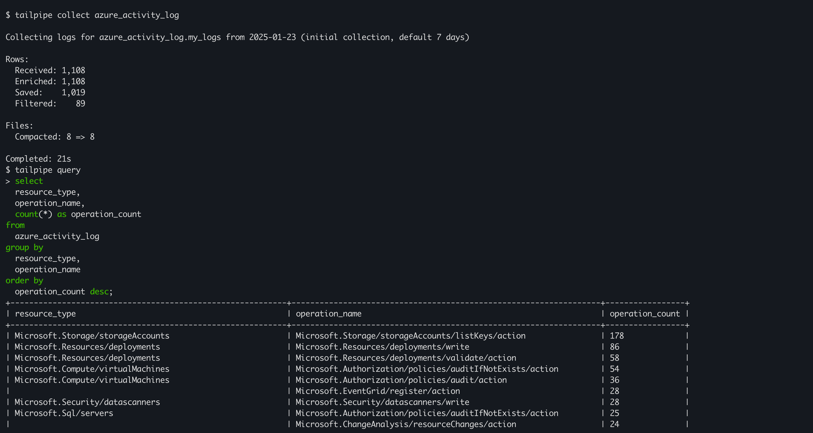
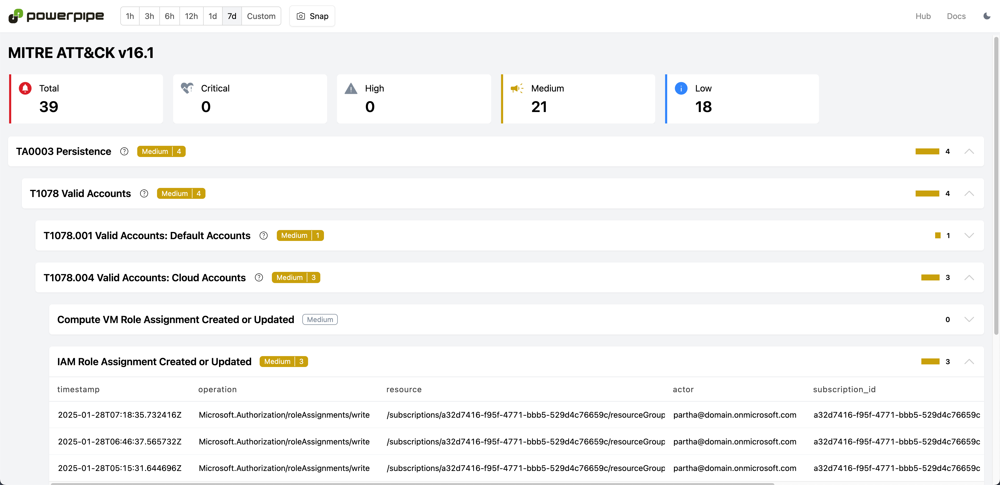

# Azure Plugin for Tailpipe

[Tailpipe](https://tailpipe.io) is an open-source CLI tool that allows you to collect logs and query them with SQL.

[Azure](https://azure.microsoft.com) provides on-demand cloud computing platforms and APIs to authenticated customers on a metered pay-as-you-go basis.

The [Azure Plugin for Tailpipe](https://hub.tailpipe.io/plugins/turbot/azure) allows you to collect and query Azure logs using SQL to track activity, monitor trends, detect anomalies, and more!

- **[Get started →](https://hub.tailpipe.io/plugins/turbot/azure)**
- Documentation: [Table definitions & examples](https://hub.tailpipe.io/plugins/turbot/azure/tables)
- Community: [Join #tailpipe on Slack →](https://turbot.com/community/join)
- Get involved: [Issues](https://github.com/turbot/tailpipe-plugin-azure/issues)

Collect and query logs:


## Getting Started

Install Tailpipe from the [downloads](https://tailpipe.io/downloads) page:

```sh
# MacOS
brew install turbot/tap/tailpipe
```

```sh
# Linux or Windows (WSL)
sudo /bin/sh -c "$(curl -fsSL https://tailpipe.io/install/tailpipe.sh)"
```

Install the plugin:

```sh
tailpipe plugin install azure
```

Configure your [connection credentials](https://hub.tailpipe.io/plugins/turbot/azure#connection-credentials), table partition, and data source ([examples](https://hub.tailpipe.io/plugins/turbot/azure/tables/azure_activity_log#example-configurations)):

```sh
vi ~/.tailpipe/config/azure.tpc
```

```hcl
connection "azure" "azure_auth" {
  tenant_id       = "my_tenant_id"
  subscription_id = "my_subscription_id"
  client_id       = "my_client_id"
  client_secret   = "my_client_secret"  
}

partition "azure_activity_log" "azure_auth" {
  source "azure_blob_storage" {
    connection   = connection.azure.cli_auth
    account_name = "storage_account_name"
    container    = "container_name"
  }
}
```

Download, enrich, and save logs from your source ([examples](https://tailpipe.io/docs/reference/cli/collect)):

```sh
tailpipe collect azure_activity_log
```

Enter interactive query mode:

```sh
tailpipe query
```

Run a query:

```sql
select
  event_source,
  event_name,
  count(*) as event_count
from
  azure_activity_log
group by
  event_source,
  event_name
order by
  event_count desc;
```

```sh
+------------------------+---------------------------+-------------+
| event_source           | event_name                | event_count |
+------------------------+---------------------------+-------------+
| Microsoft.Storage      | Write                     | 780542      |
| Microsoft.Compute      | StartVirtualMachine       | 402312      |
| Microsoft.Compute      | DeallocateVirtualMachine  | 298123      |
| Microsoft.Network      | CreateSecurityRule        | 102874      |
| Microsoft.Resources    | DeployTemplate            | 89347       |
| Microsoft.KeyVault     | SetSecret                 | 48213       |
+------------------------+---------------------------+-------------+
```

## Detections as Code with Powerpipe

Pre-built dashboards and detections for the Azure plugin are available in [Powerpipe](https://powerpipe.io) mods, helping you monitor and analyze activity across your Azure accounts.

For example, the [Azure CloudTrail Logs Detections mod](https://hub.powerpipe.io/mods/turbot/tailpipe-mod-azure-cloudtrail-log-detections) scans your CloudTrail logs for anomalies, such as an S3 bucket being made public or a change in your VPC network infrastructure.

Dashboards and detections are [open source](https://github.com/topics/tailpipe-mod), allowing easy customization and collaboration.

To get started, choose a mod from the [Powerpipe Hub](https://hub.powerpipe.io/?engines=tailpipe&q=azure).



## Developing

Prerequisites:

- [Tailpipe](https://tailpipe.io/downloads)
- [Golang](https://golang.org/doc/install)

Clone:

```sh
git clone https://github.com/turbot/tailpipe-plugin-azure.git
cd tailpipe-plugin-azure
```

After making your local changes, build the plugin, which automatically installs the new version to your `~/.tailpipe/plugins` directory:

```
make
```

Re-collect your data:

```
tailpipe collect azure_activity_log
```

Try it!

```
tailpipe query
> .inspect azure_activity_log
```

## Open Source & Contributing

This repository is published under the [Apache 2.0](https://www.apache.org/licenses/LICENSE-2.0) (source code) and [CC BY-NC-ND](https://creativecommons.org/licenses/by-nc-nd/2.0/) (docs) licenses. Please see our [code of conduct](https://github.com/turbot/.github/blob/main/CODE_OF_CONDUCT.md). We look forward to collaborating with you!

[Tailpipe](https://tailpipe.io) is a product produced from this open source software, exclusively by [Turbot HQ, Inc](https://turbot.com). It is distributed under our commercial terms. Others are allowed to make their own distribution of the software, but cannot use any of the Turbot trademarks, cloud services, etc. You can learn more in our [Open Source FAQ](https://turbot.com/open-source).

## Get Involved

**[Join #tailpipe on Slack →](https://turbot.com/community/join)**

Want to help but don't know where to start? Pick up one of the `help wanted` issues:

- [Tailpipe](https://github.com/turbot/tailpipe/labels/help%20wanted)
- [Azure Plugin](https://github.com/turbot/tailpipe-plugin-azure/labels/help%20wanted)
